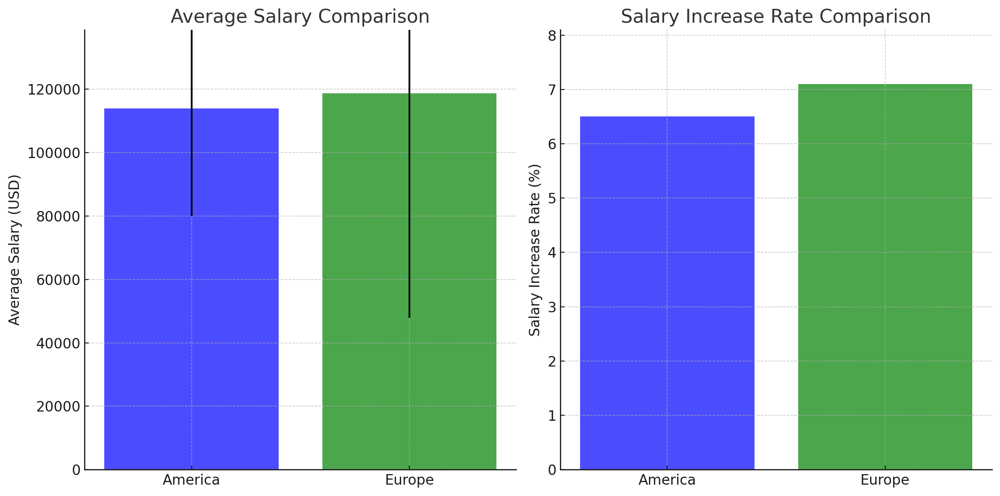

# Go Bilenlerin Kazançları

Go dili herşeyden önce size çok iyi gelir sağlayacak. Artan talep pazarına sizlere daha geniş çalışma imkanları sağlayacak. Bu verileri chatgpt ile onaylayabilirsiniz.

İşte Go programlama dili için Amerika ve Avrupa'daki maaş trendlerine dair bir özet:

## Maaş Özeti

| **Bölge**  | **Ortalama Maaş (USD)**                | **Maaş Aralığı (USD)** | **Maaş Artış Oranı** |
| ----------------- | --------------------------------------------- | -------------------------------- | ------------------------------ |
| **Amerika** | $113,886                 | $80,000 - $160,000 | %6.5                             |                                |
| **Avrupa**  | $118,734                 | $47,900 - $200,000 | %7.1                             |                                |

## Maaş Dağılımı

1. **Amerika**:

   - Go geliştiricileri için ortalama maaş yaklaşık **$113,886**.
   - Maaş aralığı **$80,000** (10. yüzde) ile **$160,000** (90. yüzde) arasında değişiyor.
   - Amerika'da Go geliştiricileri için maaş artış oranı yaklaşık **%6.5**【9†source】【10†source】.
2. **Avrupa**:

   - Avrupa'daki ortalama maaş yaklaşık **$118,734** ve bu, Amerika'dakinden biraz daha yüksek.
   - Maaş aralığı oldukça geniş, en düşük maaş **$47,900** ve en yüksek maaş ise **$200,000** seviyelerine kadar çıkabiliyor.
   - Avrupa'daki Go geliştiricileri için maaş artış oranı yaklaşık **%7.1**【9†source】【10†source】.
