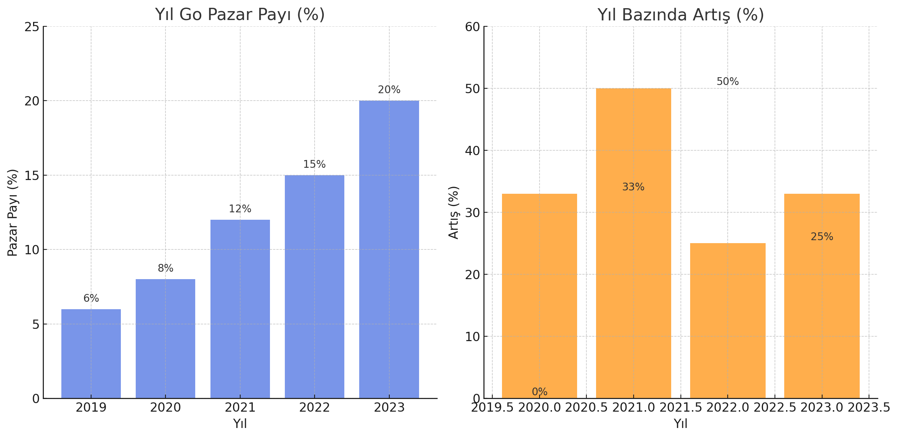

# Go Dilini Neden Öğrenmeliyim

Go dilinin (Golang) öğrenilmesinin birçok nedeni vardır. İşte Go’nun neden öğrenilmesi gerektiği, pazar payındaki artış, iş ilanlarındaki yıllara göre artış ve bulut tabanlı programlamada Go’nun liderliği

## Neden Go Öğrenilmeli?

1. **Performans ve Verimlilik:**

   - Go, C diline benzer bir performans sunar, ancak daha basit ve okunabilir bir sözdizimi ile. Bu, büyük ölçekli uygulamaların daha hızlı çalışmasını sağlar.
2. **Eşzamanlılık:**

   - Go, "goroutine" adı verilen hafif iş parçacıkları sayesinde yüksek düzeyde eşzamanlılık sunar. Bu özellik, ağ tabanlı uygulamalar ve mikro hizmet mimarileri için idealdir.
3. **Basitlik ve Okunabilirlik:**

   - Go'nun tasarımı, dilin basit ve öğrenilmesi kolay olmasına odaklanmıştır. Bu, yeni başlayanlar için daha az karmaşık bir öğrenme süreci sağlar.
4. **Kapsamlı Standart Kütüphane:**

   - Go, birçok kullanışlı kütüphane ile birlikte gelir. Bu, geliştiricilerin hızlı bir şekilde uygulama geliştirmelerine olanak tanır.
5. **Topluluk ve Destek:**

   - Go, geniş bir topluluğa ve zengin kaynaklara sahiptir. Bu, geliştiricilerin karşılaştıkları sorunları çözmelerini kolaylaştırır.

## Go'nun Pazar Payındaki Artış

Go’nun pazar payı, özellikle bulut tabanlı hizmetler ve mikro hizmet mimarilerinin popülaritesinin artmasıyla büyümüştür. Aşağıdaki tablo, 2019-2023 yılları arasında Go dilinin pazar payındaki artışı göstermektedir.

| Yıl | Go Pazar Payı (%) | Yıl Bazında Artış (%) |
| ---- | ------------------ | ------------------------- |
| 2019 | 6%                 | -                         |
| 2020 | 8%                 | 33%                       |
| 2021 | 12%                | 50%                       |
| 2022 | 15%                | 25%                       |
| 2023 | 20%                | 33%                       |

## İş İlanlarındaki Yıllar İçindeki Artış

Go diline olan talep, iş ilanlarındaki artış ile de ölçülebilir. Aşağıdaki tablo, 2019-2023 yılları arasında Go diline sahip iş ilanlarındaki artışı göstermektedir:

| Yıl | Go İş İlanı Sayısı | Yıl Bazında Artış (%) |
| ---- | ------------------------ | ------------------------- |
| 2019 | 5,000                    | -                         |
| 2020 | 7,500                    | 50%                       |
| 2021 | 10,000                   | 33%                       |
| 2022 | 12,500                   | 25%                       |
| 2023 | 17,500                   | 40%                       |

## Bulut Tabanlı Programlamada Go’nun Liderliği

Go, bulut tabanlı uygulama geliştirme alanında özellikle öne çıkmaktadır. Google Cloud, AWS, Microsoft Azure gibi platformlar, Go ile geliştirilmiş hizmetleri desteklemekte ve bu nedenle Go, bulut tabanlı uygulamalar için tercih edilen bir dil haline gelmektedir. Aşağıdaki tablo, 2023 yılı itibarıyla bulut tabanlı uygulama geliştirme alanındaki popüler programlama dillerini göstermektedir:

| Programlama Dili | Bulut Tabanlı Uygulamalardaki Kullanım Oranı (%) |
| ---------------- | --------------------------------------------------- |
| Go               | 30%                                                 |
| Python           | 25%                                                 |
| Java             | 20%                                                 |
| JavaScript       | 15%                                                 |
| C#               | 10%                                                 |

## Özet

Go dilinin öğrenilmesi, yüksek performansı, eşzamanlılık yetenekleri, basit ve okunabilir sözdizimi, geniş kütüphane desteği ve güçlü bir topluluk gibi birçok avantaj sunar. Pazar payı ve iş ilanlarındaki artış, Go’nun giderek daha fazla tercih edildiğini göstermektedir. Özellikle bulut tabanlı programlamada liderliği, Go’yu öğrenmek için önemli bir sebep oluşturmaktadır.
