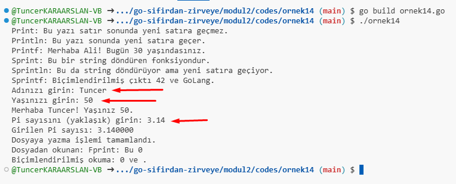
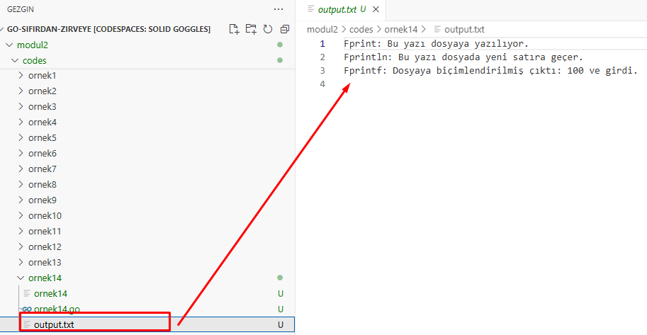

Aşağıda, `fmt` paketindeki tüm temel fonksiyonları kullanan kapsamlı bir örnek bulunuyor. Bu örnekte yazdırma, formatlı yazdırma, kullanıcıdan girdi alma ve dosya gibi farklı çıktı hedeflerine yazdırma işlemleri ele alınmıştır. Örnek içerisinde ilk defa göreceğiniz komutlar yer alıyor. İlerleyen konularda tüm komutlar işlenmiş olacak. LÜtfen şimdilik sadece komutları ve üretilen çıktıları inceleyin. Kodların ne yaptığını hızlıca anlayacaksınız.

### Örnek: `fmt` Paketinin Tüm Fonksiyonlarını Kullanma

[Örnek 14 Code](codes/ornek14/ornek14.go)


```go
package main

import (
	"fmt"
	"os"
)

func main() {
	// Print, Println, Printf ile yazdırma işlemleri
	fmt.Print("Print: Bu yazı satır sonunda yeni satıra geçmez.\n")
	fmt.Println("Println: Bu yazı sonunda yeni satıra geçer.")
	fmt.Printf("Printf: Merhaba %s! Bugün %d yaşındasınız.\n", "Ali", 30)

	// Sprint, Sprintln, Sprintf ile string olarak çıktılar
	str1 := fmt.Sprint("Sprint: Bu bir string döndüren fonksiyondur. ")
	str2 := fmt.Sprintln("Sprintln: Bu da string döndürüyor ama yeni satıra geçiyor.")
	str3 := fmt.Sprintf("Sprintf: Biçimlendirilmiş çıktı %d ve %s.\n", 42, "GoLang")

	fmt.Println(str1)
	fmt.Print(str2)
	fmt.Print(str3)

	// Kullanıcıdan girdi alma: Scan, Scanln, Scanf
	var name string
	var age int
	fmt.Print("Adınızı girin: ")
	fmt.Scan(&name) // Boşluklarla ayrılmış çoklu girişleri okur
	fmt.Print("Yaşınızı girin: ")
	fmt.Scanln(&age) // Tek satırda giriş alır, yeni satır bekler

	fmt.Printf("Merhaba %s! Yaşınız %d.\n", name, age)

	// Formatlı girdi alma: Scanf
	var pi float64
	fmt.Print("Pi sayısını (yaklaşık) girin: ")
	fmt.Scanf("%f", &pi) // Formatlı veri okur
	fmt.Printf("Girilen Pi sayısı: %f\n", pi)

	// Dosyaya yazma: Fprint, Fprintln, Fprintf
	file, err := os.Create("output.txt")
	if err != nil {
		fmt.Println("Dosya oluşturulamadı:", err)
		return
	}
	defer file.Close()

	fmt.Fprint(file, "Fprint: Bu yazı dosyaya yazılıyor.\n")
	fmt.Fprintln(file, "Fprintln: Bu yazı dosyada yeni satıra geçer.")
	fmt.Fprintf(file, "Fprintf: Dosyaya biçimlendirilmiş çıktı: %d ve %s.\n", 100, "girdi")

	fmt.Println("Dosyaya yazma işlemi tamamlandı.")

	// Dosyadan okuma: Fscan, Fscanln, Fscanf
	file, err = os.Open("output.txt")
	if err != nil {
		fmt.Println("Dosya açılamadı:", err)
		return
	}
	defer file.Close()

	var data1, data2 string
	var data3 int
	fmt.Fscan(file, &data1, &data2, &data3)
	fmt.Println("Dosyadan okunan:", data1, data2, data3)

	// Biçimlendirilmiş okuma: Fscanf
	file.Seek(0, 0) // Dosyanın başına geri dön
	var readStr string
	var readInt int
	fmt.Fscanf(file, "Fprintf: Dosyaya biçimlendirilmiş çıktı: %d ve %s.\n", &readInt, &readStr)
	fmt.Printf("Biçimlendirilmiş okuma: %d ve %s.\n", readInt, readStr)
}
```






### Örnek Açıklamaları:

1. **Yazdırma Fonksiyonları**: 
   - `Print`, `Println`, ve `Printf` kullanarak ekrana çıktı yazdırılır. `Printf`, biçimlendirilmiş bir şekilde çıktı üretir.

2. **String Döndüren Yazdırma Fonksiyonları**:
   - `Sprint`, `Sprintln`, ve `Sprintf`, çıktıyı bir string olarak döndürür. Bu string'ler daha sonra yazdırılabilir veya başka işlemler için kullanılabilir.

3. **Kullanıcıdan Girdi Alma**:
   - `Scan`, `Scanln`, ve `Scanf` ile kullanıcıdan girdi alınır. `Scan`, boşlukla ayrılmış çoklu değerler okurken, `Scanln` yeni satıra kadar olan değerleri okur. `Scanf`, formatlı veri girişini okur.

4. **Dosyaya Yazdırma**:
   - `Fprint`, `Fprintln`, ve `Fprintf`, bir dosyaya yazmak için kullanılır. `os.Create` fonksiyonu ile bir dosya oluşturulur ve bu dosyaya yazma işlemi yapılır.

5. **Dosyadan Okuma**:
   - `Fscan`, `Fscanln`, ve `Fscanf`, bir dosyadan veri okumak için kullanılır. `os.Open` ile dosya açılır ve bu dosyadan veri okunur.

### Çıktı:
- Terminalde yazdırmalar, kullanıcı girdileri ve formatlı çıktı gözükecektir.
- `output.txt` adlı dosyaya yazılan veriler de dosyada saklanacak ve dosya içeriği okunarak terminale yazdırılacaktır.

