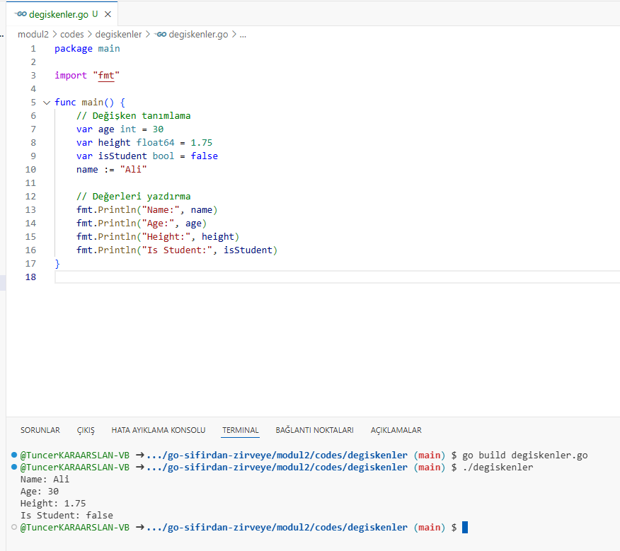

Go dilinde değişkenler ve veri tipleri, programın temel yapı taşlarındandır. 

### 1. Değişken Tanımlama

Go dilinde değişken tanımlamanın birkaç yolu vardır:

#### a. `var` Anahtar Kelimesi ile Değişken Tanımlama

`var` anahtar kelimesi kullanılarak değişken tanımlanabilir. Bu yöntemle değişkenin tipi açıkça belirtilmelidir.

```go
var x int // x adında bir tamsayı değişkeni tanımlanıyor
var y float64 = 3.14 // y adında bir float64 değişkeni tanımlanıyor ve başlangıç değeri atanıyor
var name string = "Go Dili" // name adında bir string değişkeni tanımlanıyor
```

#### b. Kısa Tanımlama (:=)

Kısa tanımlama operatörü (`:=`) kullanılarak değişkenler tanımlanabilir. Bu yöntem, yalnızca yerel değişkenler için geçerlidir ve tip çıkarımı yapılır.

```go
x := 10 // x adında bir tamsayı değişkeni tanımlanıyor ve 10 değeri atanıyor
y := 3.14 // y adında bir float64 değişkeni tanımlanıyor
name := "Go Dili" // name adında bir string değişkeni tanımlanıyor
```

### 2. Veri Tipleri

Go, çeşitli veri tipleri sunar. Bunlar arasında temel veri tipleri ve yapısal veri tipleri bulunmaktadır.

#### a. Temel Veri Tipleri

1. **Tamsayılar (Integer Types)**:
   - `int` (platforma bağlı olarak 32 veya 64 bit)
   - `int8` (8 bit tamsayı)
   - `int16` (16 bit tamsayı)
   - `int32` (32 bit tamsayı)
   - `int64` (64 bit tamsayı)
   - `uint` (platforma bağlı olarak 32 veya 64 bit işaretsiz tamsayı)
   - `uint8`, `uint16`, `uint32`, `uint64` (işaretsiz tamsayılar)

2. **Ondalık Sayılar (Floating Point Types)**:
   - `float32` (32 bit ondalıklı sayı)
   - `float64` (64 bit ondalıklı sayı)

3. **Boole (Boolean)**:
   - `bool` (true veya false değerlerini alabilir)

4. **Karakter Dizileri (String)**:
   - `string` (metinleri temsil eder)

#### b. Yapısal Veri Tipleri

1. **Diziler (Arrays)**:
   - Sabit boyutlu veri yapılarıdır. Örneğin: `var a [5]int` (5 elemanlı bir tamsayı dizisi).

2. **Kesitler (Slices)**:
   - Dinamik boyutlu dizilerdir. Örneğin: `var b []int` (tamsayı kesiti).

3. **Haritalar (Maps)**:
   - Anahtar-değer çiftlerini depolamak için kullanılır. Örneğin: `var m map[string]int` (string anahtarları ve tamsayı değerleri içeren bir harita).

4. **Yapılar (Structs)**:
   - Farklı veri tiplerini bir araya getiren özelleştirilmiş veri tipleridir. Örneğin:
   ```go
   type Person struct {
       Name string
       Age  int
   }
   ```

5. **Arayüzler (Interfaces)**:
   - Bir nesnenin bir veya daha fazla yöntemini tanımlayan türlerdir.

### Örnek Kullanım

Aşağıda, değişkenlerin ve veri tiplerinin kullanıldığı basit bir örnek verilmiştir:

```go
package main

import "fmt"

func main() {
    // Değişken tanımlama
    var age int = 30
    var height float64 = 1.75
    var isStudent bool = false
    name := "Ali"

    // Değerleri yazdırma
    fmt.Println("Name:", name)
    fmt.Println("Age:", age)
    fmt.Println("Height:", height)
    fmt.Println("Is Student:", isStudent)
}
```
!

Bu örnekte, farklı veri tiplerinde değişkenler tanımlanmış ve bu değişkenlerin değerleri `fmt.Println` ile yazdırılmıştır. Go dilinde değişkenler ve veri tipleri, uygulama geliştirme sürecinde önemli bir rol oynar ve doğru kullanımları yazılımın başarısını etkileyebilir.