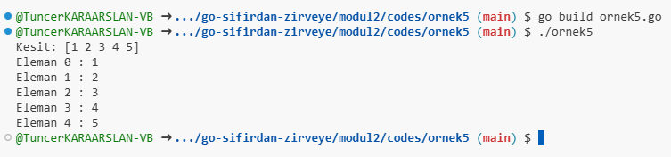

# Veri Tipleri

Go dilinde sayısal, karakter, mantıksal ve diziler gibi temel veri türleri, programlamanın temel taşlarıdır. Aşağıda her bir veri türü hakkında detaylı bilgi verilmiştir.

## 1. Sayısal Veri Türleri

Go dilinde sayısal veri türleri iki ana kategoriye ayrılır: tamsayılar ve ondalıklı sayılar.

### a. Tamsayılar (Integers)

- **int**: Platforma bağlı olarak 32 veya 64 bit.
- **int8**: 8 bit işaretli tamsayı. (-128 ile 127 arasında değer alabilir)
- **int16**: 16 bit işaretli tamsayı. (-32,768 ile 32,767 arasında değer alabilir)
- **int32**: 32 bit işaretli tamsayı. (-2,147,483,648 ile 2,147,483,647 arasında değer alabilir)
- **int64**: 64 bit işaretli tamsayı. (-9,223,372,036,854,775,808 ile 9,223,372,036,854,775,807 arasında değer alabilir)
- **uint**: Platforma bağlı olarak 32 veya 64 bit işaretsiz tamsayı.
- **uint8**: 8 bit işaretsiz tamsayı. (0 ile 255 arasında değer alabilir)
- **uint16**: 16 bit işaretsiz tamsayı. (0 ile 65,535 arasında değer alabilir)
- **uint32**: 32 bit işaretsiz tamsayı. (0 ile 4,294,967,295 arasında değer alabilir)
- **uint64**: 64 bit işaretsiz tamsayı. (0 ile 18,446,744,073,709,551,615 arasında değer alabilir)

### b. Ondalıklı Sayılar (Floating Point Numbers)

- **float32**: 32 bit ondalıklı sayı.
- **float64**: 64 bit ondalıklı sayı.

### c. Örnek Kullanım

[Örnek 1 Code](codes/ornek1/ornek1.go)

```go
package main

import "fmt"

func main() {
    var a int = 42
    var b float64 = 3.14

    fmt.Println("Tamsayı:", a)
    fmt.Println("Ondalık Sayı:", b)
}
```


## 2. Karakter Veri Türü

Go dilinde karakterler `string` veri tipi ile temsil edilir. `string`, metinleri depolamak için kullanılır ve Unicode karakterlerini destekler.

### a. Örnek Kullanım

[Örnek 2 Code](codes/ornek2/ornek2.go)

```go
package main

import "fmt"

func main() {
    var name string = "Go Dili"
    fmt.Println("Karakter Dizisi:", name)
}
```


## 3. Mantıksal Veri Türü

Mantıksal veri türü `bool` olarak adlandırılır ve iki değer alabilir: `true` veya `false`. Mantıksal değişkenler genellikle koşul ifadelerinde kullanılır.

### a. Örnek Kullanım

[Örnek 3 Code](codes/ornek3/ornek3.go)

```go
package main

import "fmt"

func main() {
    var isActive bool = true
    fmt.Println("Aktif Mi?:", isActive)
}
```


## 4. Diziler (Arrays)

Diziler, aynı türdeki birden fazla veriyi saklamak için kullanılan veri yapılarıdır. Go dilinde dizilerin boyutu sabittir. Dizinin boyutu tanımlanırken belirtilmelidir.

### a. Dizinin Tanımlanması

```go
var numbers [5] int // 5 elemanlı bir tamsayı dizisi
```

### b. Dizinin Kullanımı

Dizinin elemanlarına erişim indeks kullanılarak yapılır. İndeksler 0'dan başlar.

### c. Örnek Kullanım

[Örnek 4 Code](codes/ornek4/ornek4.go)

```go
package main

import "fmt"

func main() {
    var numbers [5]int = [5]int{1, 2, 3, 4, 5}

    fmt.Println("Dizi:", numbers)

    // Dizinin elemanlarına erişim
    for i := 0; i < len(numbers); i++ {
        fmt.Println("Eleman", i, ":", numbers[i])
    }
}
```


## 5. Kesitler (Slices)

Kesitler, dinamik boyutlu dizilerdir ve `make` fonksiyonu kullanılarak oluşturulabilir. Kesitler, dizilerden daha esnek ve kullanışlıdır.

### a. Kesit Tanımlama

```go
slice := make([]int, 0) // Boş bir tamsayı kesiti
```

### b. Örnek Kullanım

[Örnek 5 Code](codes/ornek5/ornek5.go)

```go
package main

import "fmt"

func main() {
    // Bir kesit oluşturma
    numbers := []int{1, 2, 3, 4, 5}

    fmt.Println("Kesit:", numbers)

    // Kesit elemanlarına erişim
    for i, v := range numbers {
        fmt.Println("Eleman", i, ":", v)
    }
}
```



## Sonuç

Go dilinde sayısal, karakter, mantıksal veri türleri ve diziler, verileri yapılandırmak ve yönetmek için kritik öneme sahiptir. Bu türleri etkili bir şekilde kullanmak, yazılım geliştirme sürecinde verimliliği artırır ve kodun okunabilirliğini sağlar.
