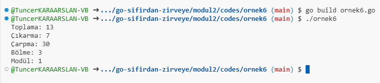
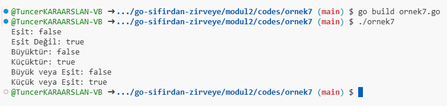
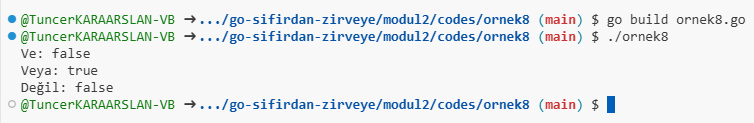

Go dilinde operatörler ve ifadeler, programlama dilinin temel yapı taşlarından biridir. Bu operatörler matematiksel işlemler, karşılaştırmalar ve mantıksal işlemler yapmak için kullanılır. İşte Go dilindeki operatörler ve ifadeler hakkında kısa bir açıklama:

### 1. Matematiksel Operatörler

Matematiksel operatörler, sayısal değerler üzerinde işlem yapar. Go dilinde kullanılan temel matematiksel operatörler şunlardır:

- **Toplama (`+`)**: İki sayıyı toplar.
- **Çıkarma (`-`)**: İki sayıdan birini çıkarır.
- **Çarpma (`*`)**: İki sayıyı çarpar.
- **Bölme (`/`)**: Bir sayıyı diğerine böler.
- **Modül (`%`)**: İki sayının bölümünden kalanı döner.

**Örnek:**

[Örnek 6 Code](codes/ornek6/ornek6.go)

```go
package main

import "fmt"

func main() {
    a := 10
    b := 3

    fmt.Println("Toplama:", a + b)   // 13
    fmt.Println("Çıkarma:", a - b)    // 7
    fmt.Println("Çarpma:", a * b)     // 30
    fmt.Println("Bölme:", a / b)       // 3
    fmt.Println("Modül:", a % b)      // 1
}
```


### 2. Karşılaştırma Operatörleri

Karşılaştırma operatörleri, iki değeri karşılaştırarak bir boolean (true/false) sonucu döner. Go dilinde kullanılan karşılaştırma operatörleri şunlardır:

- **Eşit (`==`)**: İki değerin eşit olup olmadığını kontrol eder.
- **Eşit Değil (`!=`)**: İki değerin eşit olmadığını kontrol eder.
- **Büyüktür (`>`)**: Bir değerin diğerinden büyük olup olmadığını kontrol eder.
- **Küçüktür (`<`)**: Bir değerin diğerinden küçük olup olmadığını kontrol eder.
- **Büyük veya Eşit (`>=`)**: Bir değerin diğerine büyük veya eşit olup olmadığını kontrol eder.
- **Küçük veya Eşit (`<=`)**: Bir değerin diğerine küçük veya eşit olup olmadığını kontrol eder.

**Örnek:**

[Örnek 7 Code](codes/ornek7/ornek7.go)

```go
package main

import "fmt"

func main() {
    a := 5
    b := 10

    fmt.Println("Eşit:", a == b)               // false
    fmt.Println("Eşit Değil:", a != b)         // true
    fmt.Println("Büyüktür:", a > b)            // false
    fmt.Println("Küçüktür:", a < b)            // true
    fmt.Println("Büyük veya Eşit:", a >= b)    // false
    fmt.Println("Küçük veya Eşit:", a <= b)    // true
}
```



### 3. Mantıksal Operatörler

Mantıksal operatörler, boolean değerler üzerinde işlem yapar. Go dilinde kullanılan mantıksal operatörler şunlardır:

- **Ve (`&&`)**: İki boolean değeri arasında "ve" işlemi yapar.
- **Veya (`||`)**: İki boolean değeri arasında "veya" işlemi yapar.
- **Değil (`!`)**: Bir boolean değerinin tersini alır.

**Örnek:**

[Örnek 8 Code](codes/ornek8/ornek8.go)

```go
package main

import "fmt"

func main() {
    a := true
    b := false

    fmt.Println("Ve:", a && b)    // false
    fmt.Println("Veya:", a || b)  // true
    fmt.Println("Değil:", !a)      // false
}
```



### Özet

Go dilinde operatörler, sayılar ve boolean değerler üzerinde işlem yapmak için kullanılır. Matematiksel operatörler, sayısal işlemleri; karşılaştırma operatörleri, değerlerin eşitliğini veya büyüklüğünü; mantıksal operatörler ise boolean ifadeleri birleştirmek için kullanılır. Bu operatörler, program yazımında önemli bir rol oynar ve ifadelerin temel yapı taşlarıdır.