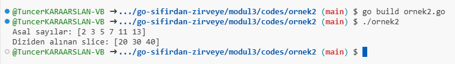

# Array Slice

## Modül 3: Veri Yapıları ve Gösterim

Go dilinde veri yapıları temel olarak **array** (diziler) ve **slice** (dilimler) üzerinden gerçekleştirilir. Array ve slice’lar Go dilinde veri kümelerini temsil etmenin önemli yollarıdır. Aşağıda, array ve slice yapılarının nasıl tanımlandığını, nasıl kullanıldığını ve farklarını detaylı bir şekilde ele alalım.

---

## 1. **Array Tanımlama ve Kullanımı**

**Array** (dizi), sabit bir uzunluğa sahip olan ve aynı türden elemanları saklayan bir veri yapısıdır. Diziler, tanımlandıktan sonra boyutları değiştirilemez. Sabit boyutlu olduğu için bellekte sabit bir alan kaplar.

[Örnek 1 Code](codes/ornek1/ornek1.go)

### Örnek: Array Tanımlama

```go
package main

import "fmt"

func main() {
    // Boyutu sabit olan bir int dizisi tanımlama
    var numbers [5]int

    // Dizinin elemanlarına değer atama
    numbers[0] = 10
    numbers[1] = 20
    numbers[2] = 30
    numbers[3] = 40
    numbers[4] = 50

    fmt.Println("Dizi:", numbers)

    // Diziyi doğrudan tanımlama ve başlatma
    colors := [3]string{"Kırmızı", "Yeşil", "Mavi"}
    fmt.Println("Renkler:", colors)
}
```

### Çıktı

```
Dizi: [10 20 30 40 50]
Renkler: [Kırmızı Yeşil Mavi]
```


- Dizilerde eleman sayısı sabittir. Örneğin, `var numbers [5]int` ifadesi 5 elemanlı bir dizi tanımlar ve tüm elemanlar başlangıçta varsayılan değere (int için `0`) sahiptir.

---

## 2. **Slices ve Alt Dilimler**

**Slice** (dilim), Go dilinde dizilere kıyasla çok daha esnek bir yapıdır. Slice, eleman sayısı dinamik olarak değişebilen bir diziyi ifade eder. Dizi ile aynı türden verileri tutar, ancak boyutu değiştirilebilir. Slice’lar bir array üzerine kuruludur.

[Örnek 2 Code](codes/ornek2/ornek2.go)

### Örnek: Slice Tanımlama

```go
package main

import "fmt"

func main() {
    // Bir dilim (slice) tanımlama ve başlatma
    primes := []int{2, 3, 5, 7, 11, 13}
    fmt.Println("Asal sayılar:", primes)

    // Bir diziden dilim oluşturma
    var numbers = [6]int{10, 20, 30, 40, 50, 60}
    var sliceNumbers []int = numbers[1:4] // 1. indisten 4. indise kadar (4 hariç)
    fmt.Println("Diziden alınan slice:", sliceNumbers)
}
```

### Çıktı

```
Asal sayılar: [2 3 5 7 11 13]
Diziden alınan slice: [20 30 40]
```



- `primes` adlı dilim, 6 elemanlı bir dilimdir ve başlangıç değerleri ile doğrudan tanımlanmıştır.
- `sliceNumbers`, `numbers` dizisinin bir alt dilimini ifade eder ve 1. indeks ile 3. indeks arasındaki elemanları içerir (4. indeks hariç).

### Alt Dilimler

- Alt dilimler, bir dilimden veya diziden belirli bir aralık seçmek için kullanılır. `slice[start:end]` ifadesi, `start` indeksinden başlayıp `end-1` indeksine kadar olan elemanları seçer.

---

### 3. **Slices Kapasitesi ve Dinamik Yapılar**

Slice'ların en önemli özelliklerinden biri dinamik olarak genişleyebilmeleridir. Slice’ın **kapasitesi** (capacity), arka planda saklandığı array’in boyutunu ifade eder. Slice’ın uzunluğu (length), eleman sayısını gösterirken, kapasite mevcut olan kullanılabilir alanı gösterir.

[Örnek 3 Code](codes/ornek3/ornek3.go)

### Örnek: Slice Uzunluğu ve Kapasitesi

```go
package main

import "fmt"

func main() {
    // Bir slice tanımlama ve başlatma
    numbers := []int{1, 2, 3, 4, 5}

    fmt.Println("Dilim:", numbers)
    fmt.Println("Uzunluk:", len(numbers)) // 5
    fmt.Println("Kapasite:", cap(numbers)) // 5

    // Dilimi genişletme (append ile eleman ekleme)
    numbers = append(numbers, 6, 7)
    fmt.Println("Yeni dilim:", numbers)
    fmt.Println("Yeni uzunluk:", len(numbers)) // 7
    fmt.Println("Yeni kapasite:", cap(numbers)) // Genişleyebilir
}
```

### Çıktı

```
Dilim: [1 2 3 4 5]
Uzunluk: 5
Kapasite: 5
Yeni dilim: [1 2 3 4 5 6 7]
Yeni uzunluk: 7
Yeni kapasite: 10
```

- `len(slice)` fonksiyonu, dilimin uzunluğunu (eleman sayısını) döner.
- `cap(slice)` fonksiyonu, dilimin kapasitesini döner. Kapasite, slice’ın yeni elemanlar eklenmeden önce genişleyebileceği maksimum alanı ifade eder.
- **`append`** fonksiyonu ile slice'a eleman eklenir. Eğer mevcut kapasite dolduysa, Go dilinde slice'ın kapasitesi otomatik olarak iki katına çıkar.

---


### Özet

- **Array**: Sabit uzunluklu ve aynı türde veriler içerir. Bellekte sabit bir yer kaplar.
- **Slice**: Dinamik olarak genişleyebilen, esnek bir veri yapısıdır. Dizi üzerine kuruludur ve alt dilimler oluşturabilir.
- Slice'lar boyutları gerektikçe otomatik olarak büyür ve bu sayede Go'da esnek veri yapıları oluşturulabilir.
