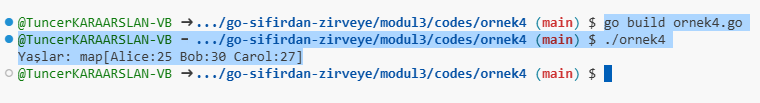
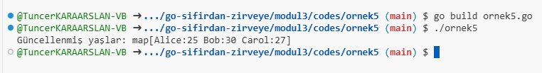
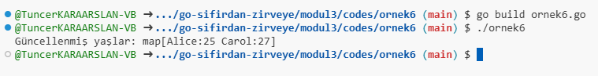
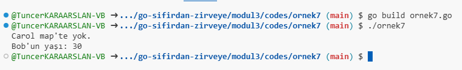

# Maps

## Modül 3: Veri Yapıları ve Gösterim - Maps (Sözlükler)

Go dilinde **map** (sözlük), bir **anahtar-değer** ilişkisine dayanan veri yapısıdır. Bu yapıda her anahtar (key) bir değere (value) karşılık gelir ve anahtarlar benzersiz olmalıdır. `map` veri yapısı dinamik olarak genişleyebilir ve farklı türde anahtar ve değerler barındırabilir.

---

### 1. **Map Veri Yapısı: Anahtar-Değer İlişkisi**

**Map**'ler bir veri kümesini anahtarlar aracılığıyla organize eder. Go'da map'ler aşağıdaki şekilde tanımlanır:

```go
// Genel map tanımı: 
// map[keyType]valueType
```

- `keyType`: Map'teki anahtarların türü (örn: `string`, `int`).
- `valueType`: Map'teki değerlerin türü (örn: `string`, `int`).

### Örnek: Map Tanımlama ve Kullanma

[Örnek 4 Code](codes/ornek4/ornek4.go)

```go
package main

import "fmt"

func main() {
    // Bir string-int map tanımlama ve başlatma
    ageMap := map[string]int{
        "Alice": 25,
        "Bob":   30,
        "Carol": 27,
    }

    // Map'in içeriğini yazdırma
    fmt.Println("Yaşlar:", ageMap)
}
```

### Çıktı

```
Yaşlar: map[Alice:25 Bob:30 Carol:27]
```



Bu örnekte:

- `ageMap` adında bir map tanımlanmıştır. Anahtarlar `string` tipindedir ve karşılık gelen değerler `int` tipindedir.
- Map başlangıçta bazı anahtar-değer çiftleri ile başlatılmıştır.

---

## 2. **Map İşlemleri: Ekleme, Silme ve Arama**

**Map'ler** üzerinde çeşitli işlemler gerçekleştirilebilir: eleman ekleme, silme ve arama işlemleri gibi.

### a. **Ekleme**

Map'e yeni bir anahtar-değer çifti eklemek için aşağıdaki sözdizimi kullanılır:

```go
mapName[key] = value
```

[Örnek 5 Code](codes/ornek5/ornek5.go)

### Örnek: Map'e Yeni Değer Ekleme

```go
package main

import "fmt"

func main() {
    ageMap := map[string]int{
        "Alice": 25,
        "Bob":   30,
    }

    // Yeni anahtar-değer çifti ekleme
    ageMap["Carol"] = 27
    fmt.Println("Güncellenmiş yaşlar:", ageMap)
}
```

### Çıktı

```
Güncellenmiş yaşlar: map[Alice:25 Bob:30 Carol:27]
```



Bu işlem, mevcut bir anahtara yeni bir değer atarsa, eski değer üzerine yazılır.

### b. **Silme**

Map'ten bir eleman silmek için `delete()` fonksiyonu kullanılır.

```go
delete(mapName, key)
```

[Örnek 6 Code](codes/ornek6/ornek6.go)

### Örnek: Map'ten Anahtar-Değer Silme

```go
package main

import "fmt"

func main() {
    ageMap := map[string]int{
        "Alice": 25,
        "Bob":   30,
        "Carol": 27,
    }

    // "Bob" anahtarını map'ten silme
    delete(ageMap, "Bob")
    fmt.Println("Güncellenmiş yaşlar:", ageMap)
}
```

### Çıktı

```
Güncellenmiş yaşlar: map[Alice:25 Carol:27]
```



Bu örnekte, `Bob` anahtarı ve karşılık gelen değeri silinmiştir.

### c. **Arama**

Bir map içinde bir anahtarın var olup olmadığını kontrol etmek için aşağıdaki yapıyı kullanabiliriz:

```go
value, exists := mapName[key]
```

- `value`: Anahtara karşılık gelen değer. Eğer anahtar yoksa varsayılan değer döner (örneğin `0`).
- `exists`: Anahtarın map'te olup olmadığını kontrol eden bir boolean.

[Örnek 7 Code](codes/ornek7/ornek7.go)

### Örnek: Map'te Anahtar Arama

```go
package main

import "fmt"

func main() {
    ageMap := map[string]int{
        "Alice": 25,
        "Bob":   30,
    }

    // "Carol" anahtarını arama
    value, exists := ageMap["Carol"]
    if exists {
        fmt.Println("Carol'ın yaşı:", value)
    } else {
        fmt.Println("Carol map'te yok.")
    }
}
```

### Çıktı

```
Carol map'te yok.
```



Eğer anahtar map'te mevcut değilse, `exists` değeri `false` olur ve map'te bulunmadığı bilgisi döner.

---

## Map'in Özet Yapısı

- **Tanımlama**: `map[keyType]valueType` şeklinde tanımlanır.
- **Ekleme**: Map'e yeni anahtar-değer çifti eklemek için `mapName[key] = value`.
- **Silme**: `delete(mapName, key)` ile anahtar ve değer silinir.
- **Arama**: `value, exists := mapName[key]` ile anahtarın olup olmadığı kontrol edilir.

Map yapıları, Go'da güçlü ve dinamik bir veri saklama yöntemi sunar. Anahtar-değer ilişkisi ile veri setlerini hızlı bir şekilde arayabilir, yönetebilir ve değiştirebilirsiniz.