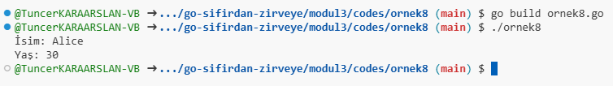
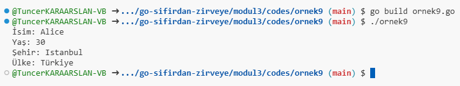
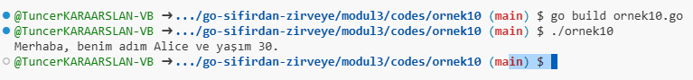

# Stucture

## Modül 3: Veri Yapıları ve Gösterim - Structs

Go dilinde **struct** (yapı), birden fazla veriyi bir arada tutabilen bir veri türüdür. Yapılar, farklı türdeki verileri bir araya getirerek daha karmaşık veri tipleri oluşturmayı sağlar. Struct'lar, özellikle nesne yönelimli programlama yaklaşımında kullanılır ve verileri gruplayarak daha düzenli ve anlamlı bir yapı oluşturur.

---

## 1. **Go’da Yapı (Struct) Tanımlama**

Struct tanımlamak için `type` anahtar kelimesi kullanılır. Aşağıda basit bir struct tanımlama örneği verilmiştir:

[Örnek 8 Code](codes/ornek8/ornek8.go)

### Örnek: Basit Bir Struct Tanımlama

```go
package main

import "fmt"

// Person adında bir struct tanımlama
type Person struct {
    Name string
    Age  int
}

func main() {
    // Struct kullanarak bir nesne oluşturma
    person1 := Person{Name: "Alice", Age: 30}
    
    // Struct içindeki verilere erişim
    fmt.Println("İsim:", person1.Name)
    fmt.Println("Yaş:", person1.Age)
}
```

### Çıktı

```
İsim: Alice
Yaş: 30
```



Bu örnekte:

- `Person` adında bir struct tanımlanmıştır ve iki alan içerir: `Name` (string) ve `Age` (int).
- `person1` adında bir `Person` nesnesi oluşturulmuş ve değerleri atanmıştır.

---

## 2. **İç İçe Struct Kullanımı**

Struct'lar, başka bir struct içinde de tanımlanabilir. Bu, verileri hiyerarşik bir şekilde organize etmek için kullanışlıdır.

[Örnek 9 Code](codes/ornek9/ornek9.go)

### Örnek: İç İçe Struct Kullanımı

```go
package main

import "fmt"

// Address adında bir struct tanımlama
type Address struct {
    City    string
    Country string
}

// Person adında bir struct tanımlama, Address içeren
type Person struct {
    Name    string
    Age     int
    Address Address // İç içe struct
}

func main() {
    // Struct kullanarak bir nesne oluşturma
    person1 := Person{
        Name: "Alice",
        Age:  30,
        Address: Address{
            City:    "Istanbul",
            Country: "Türkiye",
        },
    }

    // Struct içindeki verilere erişim
    fmt.Println("İsim:", person1.Name)
    fmt.Println("Yaş:", person1.Age)
    fmt.Println("Şehir:", person1.Address.City)
    fmt.Println("Ülke:", person1.Address.Country)
}
```

### Çıktı

```
İsim: Alice
Yaş: 30
Şehir: Istanbul
Ülke: Türkiye
```



Bu örnekte:

- `Address` adında bir struct tanımlanmış ve `City` ve `Country` alanlarını içermektedir.
- `Person` struct'ı ise bir `Address` alanı içermektedir.

---

### 3. **Struct ile Metot Tanımlama**

Go'da struct'lara metot eklemek mümkündür. Metotlar, belirli bir struct ile ilişkili işlevleri tanımlar.

[Örnek 10 Code](codes/ornek10/ornek10.go)

### Örnek: Struct Metodu Tanımlama

```go
package main

import "fmt"

// Person adında bir struct tanımlama
type Person struct {
    Name string
    Age  int
}

// Metot: Person struct'ı için bir metot tanımlama
func (p Person) Greet() {
    fmt.Printf("Merhaba, benim adım %s ve yaşım %d.\n", p.Name, p.Age)
}

func main() {
    // Struct kullanarak bir nesne oluşturma
    person1 := Person{Name: "Alice", Age: 30}

    // Metodu çağırma
    person1.Greet()
}
```

### Çıktı

```
Merhaba, benim adım Alice ve yaşım 30.
```



Bu örnekte:

- `Greet` adında bir metot tanımlanmış ve `Person` struct'ı için bir işlev oluşturmaktadır.
- Metot, `Person` nesnesinin adını ve yaşını yazdırır.

---

## Özet

- **Struct Tanımlama**: `type StructName struct { Field1 Type1; Field2 Type2; ... }`
- **İç İçe Struct**: Başka bir struct içinde bir struct kullanarak daha karmaşık veri yapıları oluşturma.
- **Metot Tanımlama**: Struct'lar için işlev tanımlamak, belirli bir struct ile ilişkili işlemleri gerçekleştirmek için kullanılır.

Struct'lar, Go dilinin güçlü ve esnek veri yapılarından biridir. Verilerinizi daha anlamlı bir şekilde düzenlemek ve yönetmek için kullanışlı bir araçtır.