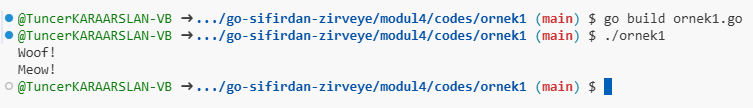
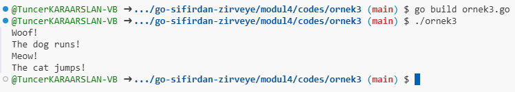
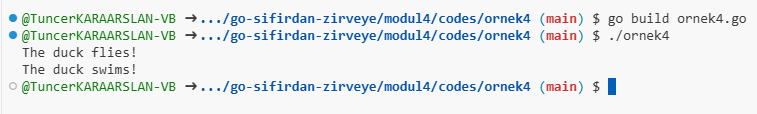
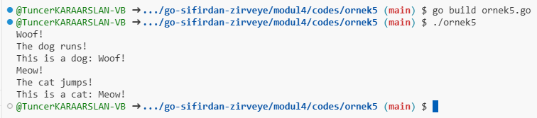

Modül 4: Arayüzler (Interfaces) ve Metotlar

### Arayüz Kavramı

Arayüzler, Go dilinde nesne yönelimli programlama (OOP) konseptlerinin temelini oluşturan bir yapıdır. Bir arayüz, bir grup metotun imzalarını tanımlayarak, bu metotları uygulayacak olan türlerin (struct) belirli bir davranışı yerine getirmesini sağlar. Go'da arayüzler, esnekliği ve yeniden kullanılabilirliği artırmak için kullanılır.

#### Arayüzlerin Go Dilindeki Yeri
- **Soyutlama**: Arayüzler, farklı türlerin benzer davranışlarını soyutlamaya yardımcı olur. Bu sayede, bir arayüzü uygulayan her tür, arayüzde tanımlı metotları gerçekleştirmek zorundadır.
- **Polimorfizm**: Arayüzler, farklı türlerin aynı arayüz üzerinden kullanılmasını sağlar. Bu, yazılımın daha esnek ve modüler olmasına yardımcı olur.

#### Arayüz Tanımlama ve Implementasyonu
Bir arayüz tanımlamak için `type` anahtar kelimesi kullanılır. Aşağıda basit bir arayüz tanımı ve bu arayüzü uygulayan bir tür örneği verilmiştir:

[Örnek 1 Code](codes/ornek1/ornek1.go)

```go
package main

import (
	"fmt"
)

// Arayüz tanımı
type Animal interface {
	Speak() string
}

// Arayüzü uygulayan bir tür
type Dog struct{}

func (d Dog) Speak() string {
	return "Woof!"
}

type Cat struct{}

func (c Cat) Speak() string {
	return "Meow!"
}

func main() {
	var animal Animal

	// Dog türünü kullanma
	animal = Dog{}
	fmt.Println(animal.Speak()) // Çıktı: Woof!

	// Cat türünü kullanma
	animal = Cat{}
	fmt.Println(animal.Speak()) // Çıktı: Meow!
}
```



Bu örnekte, `Animal` arayüzü `Speak` adlı bir metot tanımlar. `Dog` ve `Cat` türleri, bu arayüzü uygulayarak kendi `Speak` metotlarını sağlar.

#### Dinamik Tipler ve Type Assertion
Go dilinde dinamik tipler, bir arayüz değişkeni ile çalıştığınızda ortaya çıkar. Arayüzler, farklı türlerdeki verileri saklamak için kullanılabilir. Type assertion, bir arayüz değişkeninin belirli bir türde olup olmadığını kontrol etmenizi sağlar.

Type assertion kullanımı aşağıdaki gibidir:

[Örnek 2 Code](codes/ornek2//ornek2.go)

```go
package main

import (
	"fmt"
)

// Arayüz tanımı
type Animal interface {
	Speak() string
}

// Arayüzü uygulayan bir tür
type Dog struct{}

func (d Dog) Speak() string {
	return "Woof!"
}

func main() {
	var animal Animal = Dog{}

	// Type assertion
	dog, ok := animal.(Dog)
	if ok {
		fmt.Println("Animal is a Dog:", dog.Speak())
	} else {
		fmt.Println("Animal is not a Dog")
	}
}
```


Bu örnekte, `animal` değişkeninin `Dog` türünde olup olmadığını kontrol etmek için type assertion kullanılmıştır. Eğer `animal` bir `Dog` ise, `ok` değişkeni `true` değerini alır ve ilgili metot çağrılır.

Go dilinde çoklu kalıtım doğrudan desteklenmez, ancak arayüzler (interfaces) kullanarak benzer bir davranışı elde edebiliriz. Arayüzler, birden fazla arayüzün birleşimini sağlayarak çoklu kalıtım gibi bir yapı oluşturmanıza olanak tanır. Aşağıda, bu kavramı daha iyi anlamak için birkaç örnek sunuyorum.

### Örnek: Çoklu Arayüz Uygulama

Bir hayvan sınıfının farklı davranışları temsil eden birkaç arayüz tanımlayalım. Bu arayüzler, hayvanların konuşma ve hareket etme yeteneklerini tanımlasın.

[Örnek 3 Code](codes/ornek3/ornek3.go)

```go
package main

import (
	"fmt"
)

// Konuşma yeteneği
type Speaker interface {
	Speak() string
}

// Hareket etme yeteneği
type Mover interface {
	Move() string
}

// Hayvan arayüzü: Hem konuşma hem hareket etme yeteneğini içerir
type Animal interface {
	Speaker
	Mover
}

// Dog türü
type Dog struct{}

func (d Dog) Speak() string {
	return "Woof!"
}

func (d Dog) Move() string {
	return "The dog runs!"
}

// Cat türü
type Cat struct{}

func (c Cat) Speak() string {
	return "Meow!"
}

func (c Cat) Move() string {
	return "The cat jumps!"
}

func main() {
	var animal Animal

	// Dog türünü kullanma
	animal = Dog{}
	fmt.Println(animal.Speak()) // Çıktı: Woof!
	fmt.Println(animal.Move())  // Çıktı: The dog runs!

	// Cat türünü kullanma
	animal = Cat{}
	fmt.Println(animal.Speak()) // Çıktı: Meow!
	fmt.Println(animal.Move())  // Çıktı: The cat jumps!
}
```



Bu örnekte, `Animal` arayüzü hem `Speaker` hem de `Mover` arayüzlerini içerir. `Dog` ve `Cat` türleri, bu arayüzleri uygulayarak her iki davranışın da nasıl gerçekleştirileceğini tanımlar.

### Örnek: Çoklu Arayüzleri Birleştirme

Farklı arayüzleri bir araya getirerek daha karmaşık bir yapı oluşturalım.

[Örnek 4 Code](codes/ornek4/ornek4.go)

```go
package main

import (
	"fmt"
)

// Uçabilen arayüz
type Flyer interface {
	Fly() string
}

// Su üzerinde hareket edebilen arayüz
type Swimmer interface {
	Swim() string
}

// Kuş ve balık arayüzü: Uçma ve yüzme yeteneklerini içerir
type BirdFish interface {
	Flyer
	Swimmer
}

// BirdFish türü
type Duck struct{}

func (d Duck) Fly() string {
	return "The duck flies!"
}

func (d Duck) Swim() string {
	return "The duck swims!"
}

func main() {
	var birdFish BirdFish

	// Duck türünü kullanma
	birdFish = Duck{}
	fmt.Println(birdFish.Fly())  // Çıktı: The duck flies!
	fmt.Println(birdFish.Swim()) // Çıktı: The duck swims!
}
```



Burada, `BirdFish` arayüzü hem `Flyer` hem de `Swimmer` arayüzlerini içeriyor. `Duck` türü bu arayüzü uygulayarak hem uçma hem de yüzme yeteneğini kazanıyor.

### Örnek: Type Assertion ile Çoklu Kalıtım

Type assertion kullanarak bir arayüzün belirli bir türde olup olmadığını kontrol edebiliriz. Bu, farklı türlerin aynı işlevselliği nasıl sunduğunu görmek için yararlıdır.

[Örnek 5 Code](codes/ornek5/ornek5.go)

```go
package main

import (
	"fmt"
)

// Arayüzler
type Speaker interface {
	Speak() string
}

type Mover interface {
	Move() string
}

type Animal interface {
	Speaker
	Mover
}

type Dog struct{}

func (d Dog) Speak() string {
	return "Woof!"
}

func (d Dog) Move() string {
	return "The dog runs!"
}

type Cat struct{}

func (c Cat) Speak() string {
	return "Meow!"
}

func (c Cat) Move() string {
	return "The cat jumps!"
}

func main() {
	var animal Animal

	animal = Dog{}
	speakAndMove(animal)

	animal = Cat{}
	speakAndMove(animal)
}

// Type assertion ile farklı türleri kontrol etme
func speakAndMove(a Animal) {
	fmt.Println(a.Speak())
	fmt.Println(a.Move())

	// Type assertion ile Dog kontrolü
	if dog, ok := a.(Dog); ok {
		fmt.Println("This is a dog:", dog.Speak())
	}

	// Type assertion ile Cat kontrolü
	if cat, ok := a.(Cat); ok {
		fmt.Println("This is a cat:", cat.Speak())
	}
}
```



Bu örnekte, `speakAndMove` fonksiyonu bir `Animal` türünde bir argüman alır. Type assertion kullanarak, verilen argümanın `Dog` veya `Cat` olup olmadığını kontrol ederiz.

### Özet
- Arayüzler, Go dilinde nesne yönelimli programlamanın önemli bir parçasıdır ve esneklik sağlar.
- Arayüzler, bir grup metot imzasını tanımlar ve bu metotları uygulayan türlerin belirli bir davranışı yerine getirmesini zorunlu kılar.
- Dinamik tipler ve type assertion, arayüzlerle çalışma sırasında tür kontrolü yapmamıza olanak tanır.
- **Çoklu Arayüz Uygulama**: Birden fazla arayüzü birleştirerek karmaşık davranışlar tanımlayabiliriz.
- **Type Assertion**: Arayüzlerin belirli türlerle çalışmasını sağlamak için kullanılır.
- **Esneklik ve Modülerlik**: Arayüzler, farklı türlerin aynı işlevselliği paylaşmasını sağlar, bu da kodun daha esnek ve modüler olmasına olanak tanır.

Arayüzler, Go dilinde çoklu kalıtımı dolaylı olarak sağlamak için güçlü bir araçtır ve kodunuzu daha düzenli ve sürdürülebilir hale getirir.
